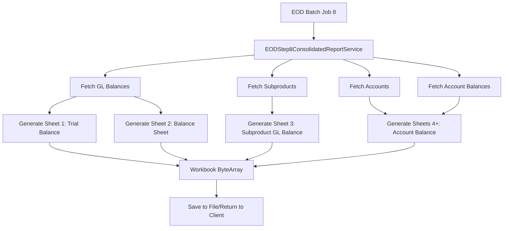

# EOD Step 8 - Quick Reference Guide

## 🚀 Quick Start

### Generate Report via API
```bash
curl -X POST "http://localhost:8080/api/eod-step8/generate-consolidated-report?eodDate=2024-03-15" \
     -H "Accept: application/vnd.openxmlformats-officedocument.spreadsheetml.sheet" \
     --output EOD_Step8_Report.xlsx
```

### Generate Report via EOD Process
The report is automatically generated during EOD Batch Job 8. No manual intervention required.

---

## 📊 Report Structure

### Sheet 1: Trial Balance
- All GL accounts with opening, DR, CR, and closing balances
- Total row with validation (DR = CR)

### Sheet 2: Balance Sheet
- Liabilities (left) and Assets (right) side-by-side
- GL-wise balances with totals

### Sheet 3: Subproduct GL Balance Report
- **BDT Accounts**: Grouped by GL with subtotals
- **FCY Accounts**: Grouped by GL with FCY and LCY amounts
- **Hyperlinks**: Click subproduct name to jump to detail sheet

### Sheets 4+: Account Balance Reports
- One sheet per subproduct
- Shows all accounts with FCY and LCY balances
- Grouped by BDT vs FCY, sub-grouped by GL
- Subtotals per GL, grand totals per currency
- Difference calculation for FCY (LCY - GL Balance)

---

## 🔑 Key Features

### ✅ Set-Based Queries
```java
// Bulk fetch - NO row-by-row loops
Map<String, AcctBal> balances = acctBalRepository
    .findByAccountNoInAndTranDate(accountNumbers, eodDate)
    .stream()
    .collect(Collectors.toMap(AcctBal::getAccountNo, ab -> ab));
```

### ✅ Hyperlinks
```java
// Internal Excel hyperlink
XSSFHyperlink link = workbook.getCreationHelper().createHyperlink(HyperlinkType.DOCUMENT);
link.setAddress("'Sheet Name'!A1");
cell.setHyperlink(link);
```

### ✅ Auto Sheet Naming
```java
// Truncates to 31 chars, removes special chars
String sheetName = truncateSheetName("Very Long Subproduct Name [Special*Chars]");
// Result: "Very Long Subproduct Name _S"
```

### ✅ No Data Handling
If a subproduct has no accounts:
```
[Subproduct Name] - Account Balance Report

No Data Available for EOD Date: 15-Mar-2024
```

---

## 📁 Files Modified/Created

### Created
- `EODStep8ConsolidatedReportService.java` (service)
- `EODStep8ConsolidatedReportController.java` (controller)
- `EODStep8ConsolidatedReportServiceTest.java` (tests)

### Modified
- `EODOrchestrationService.java` (Batch Job 8)

---

## 🧪 Testing

### Run Unit Tests
```bash
cd moneymarket
mvn test -Dtest=EODStep8ConsolidatedReportServiceTest
```

### Test Cases
1. ✅ Basic report generation
2. ✅ Multiple subproducts
3. ✅ FCY accounts handling
4. ✅ No data scenario
5. ✅ Sheet name truncation

---

## 🔍 Troubleshooting

### Hyperlink Not Working
**Cause**: Sheet name mismatch  
**Fix**: Ensure target sheet name matches truncated name (31 chars max)

### Missing Sheet
**Cause**: Subproduct has no accounts  
**Fix**: Expected behavior - sheet still created with "No Data Available" message

### Incorrect Balances
**Cause**: Data mismatch between `acc_bal` and `acc_bal_lcy`  
**Fix**: Check if FCY accounts have corresponding `acc_bal_lcy` records

### Report Too Large
**Cause**: Many subproducts with many accounts  
**Fix**: Consider filtering by date range or subproduct type

---

## 📋 Data Flow



---

## 🔐 Security

- ✅ No SQL injection (uses JPA parameters)
- ✅ No file system access (in-memory workbook)
- ✅ CORS enabled for API access
- ✅ Read-only transactions (`@Transactional(readOnly = true)`)

---

## ⚡ Performance Tips

1. **Database Indexes**: Ensure indexes on:
   - `acc_bal (account_no, tran_date)`
   - `acc_bal_lcy (account_no, tran_date)`
   - `cust_acct_master (sub_product_id)`
   - `of_acct_master (sub_product_id)`

2. **Connection Pooling**: Configure adequate pool size
   ```yaml
   spring:
     datasource:
       hikari:
         maximum-pool-size: 20
   ```

3. **Memory**: Ensure sufficient heap for large reports
   ```bash
   java -Xmx2G -jar moneymarket.jar
   ```

---

## 📝 Code Examples

### Custom Date Range (Future Enhancement)
```java
@PostMapping("/generate-consolidated-report-range")
public ResponseEntity<?> generateRange(
    @RequestParam LocalDate startDate,
    @RequestParam LocalDate endDate) {
    // Implementation for date range reports
}
```

### Filter by Subproduct
```java
public byte[] generateForSubproduct(String subproductCode, LocalDate eodDate) {
    SubProdMaster subProduct = subProdMasterRepository
        .findBySubProductCode(subproductCode)
        .orElseThrow(() -> new BusinessException("Subproduct not found"));
    // Generate single-subproduct report
}
```

---

## 🐛 Common Issues

| Issue | Cause | Solution |
|-------|-------|----------|
| OutOfMemoryError | Too many accounts | Increase heap: `-Xmx4G` |
| Sheet limit exceeded | >1000 sheets | Excel max is 255 sheets |
| Slow generation | Large dataset | Add pagination/filtering |
| Missing hyperlinks | Name sanitization | Check `truncateSheetName()` |

---

## 📞 Support

- **Logs**: Check `log.info()` statements in service
- **Documentation**: See `EOD_STEP8_ACCOUNT_BALANCE_REPORT.md`
- **Implementation**: See `IMPLEMENTATION_SUMMARY.md`

---

## 🎯 Best Practices

1. ✅ Always pass `eodDate` parameter for consistency
2. ✅ Run during off-peak hours (part of EOD batch)
3. ✅ Monitor log files for warnings/errors
4. ✅ Keep report files archived by date
5. ✅ Test with sample data before production use

---

## 📦 Dependencies

```xml
<!-- Already in pom.xml -->
<dependency>
    <groupId>org.apache.poi</groupId>
    <artifactId>poi-ooxml</artifactId>
</dependency>
```

---

## 🔄 Maintenance

### Add New Column to Report
1. Update header array in `generateAccountBalanceDetailSheet()`
2. Add cell creation in data loop
3. Update tests to verify new column

### Change Formatting
1. Modify style methods (e.g., `createHeaderStyle()`)
2. Apply to all sheets for consistency
3. Test visual output in Excel

---

**Last Updated**: March 5, 2026  
**Version**: 1.0.0
